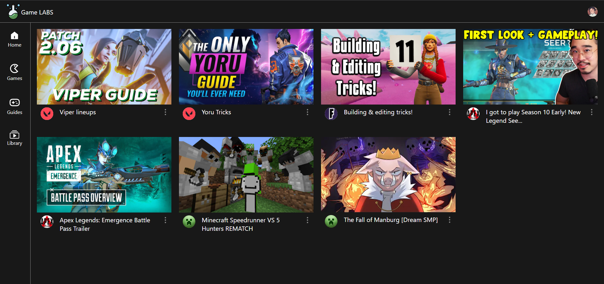
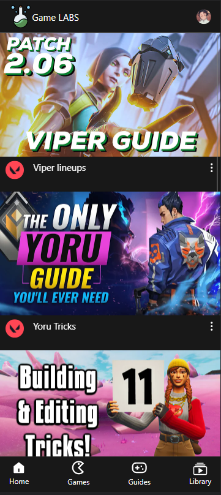
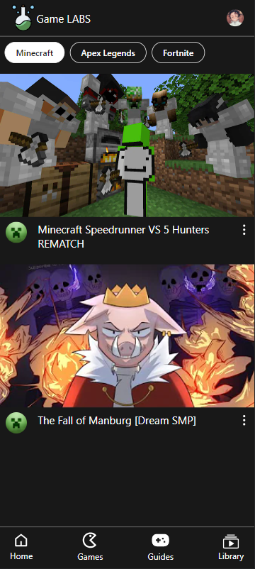

# Game Labs 🎮

A video library app for games assorted by different games and categories.

Live link: https://game-labs.netlify.app

Backend: https://github.com/OmkarArora/game-labs-backend

---

## Tech Stack

- ReactJS, React Router v6
- [Shoto UI](https://shotoui.netlify.app)
- ExpressJS
- MongoDB

## Tech stack

- Frontend
  - React
  - React Router
  - [Shoto UI](https://shotoui.netlify.app)
- Backend
  - Express
  - Mongoose
  - MongoDB
  - JWT

## Features

- User authentication : Login/SignUp
- Create/Edit/Delete playlists
- Add/Remove videos from playlist
- Subscribe/Unsubscribe from categories

---

## Screenshots

### Desktop

### Mobile

<table>
  <tr>
    <td></td>
    <td></td>
  </tr>
 </table>
